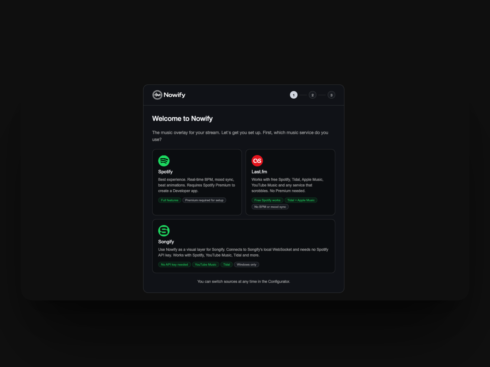
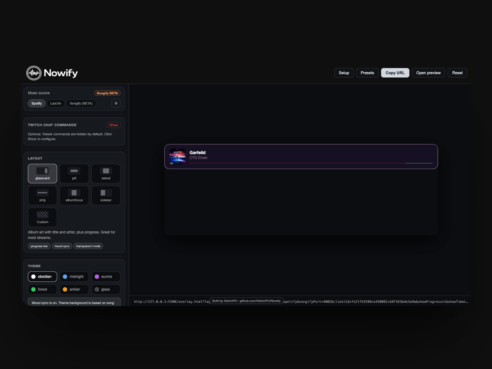
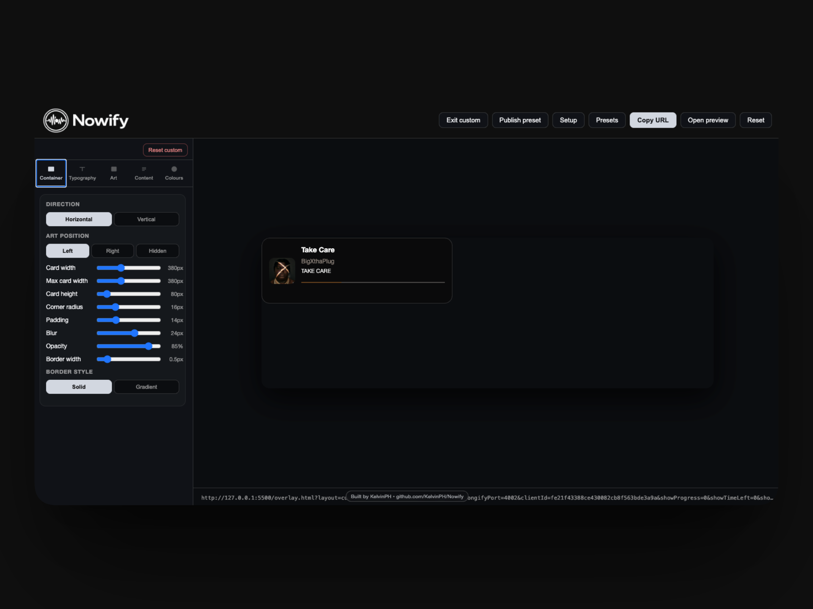

# Nowify

**The ultimate music overlay for streamers**

## What is Nowify?

Nowify is a real-time music overlay for OBS, Streamlabs, and StreamElements.
It supports multiple music sources:
- Spotify (direct API)
- Last.fm (scrobble-based)
- Songify (local WebSocket bridge)

You can run the core overlay directly in the browser with no server required for the base overlay.
Nowify is open source, free to use, and designed for streamers who want polished music visuals quickly.

## Project history

Nowify is the next generation of the original SpotiStream project.
SpotiStream is the first version, and Nowify is the improved version with a cleaner structure, better maintainability, and a more modern configurator experience.

- Original project: [SpotiStream](https://github.com/KelvinPH/SpotiStream)
- More projects by KelvinPH: [GitHub repositories](https://github.com/KelvinPH?tab=repositories)

## Features

- **Spotify overlay**
  - Real-time now-playing, progress, and playback state
  - Optional BPM + mood sync (Spotify audio features)
  - Works as an OBS/Streamlabs/StreamElements Browser Source
- **Configurator**
  - Seven layouts: `glasscard`, `pill`, `island`, `strip`, `albumfocus`, `sidebar`, `custom`
  - Six themes: `obsidian`, `midnight`, `aurora`, `forest`, `amber`, `glass`
  - Live preview + copyable URL params
- **Custom mode**
  - Full visual editor for spacing, typography, artwork, colors, and content toggles
  - Publish and browse community presets
  - Delete your own published presets
- **Optional integrations**
  - Twitch chat commands: `!sr`, `!skip`, `!prev`
  - Last.fm fallback credentials in Configurator
  - Songify source integration ([songify-rocks/Songify](https://github.com/songify-rocks/Songify))
- **Stats**
  - Session history, mood/activity insights, and exportable recap data

## Quick start

1. **Choose your music source**  
   Use the setup wizard in the Configurator to choose Spotify, Last.fm, or Songify.
2. **Open the Configurator**  
   Go to [https://kelvinph.github.io/Nowify/config.html](https://kelvinph.github.io/Nowify/config.html).
3. **Paste URL into OBS Browser Source**  
   Use the copied overlay URL with a browser source size of `900x300`.

## Screenshots

  
  

  

## Configurator

The Configurator provides a live iframe preview and full control over layout/theme options.  
Use the **Presets** button in the header to browse public presets from the start, then switch into **Custom** mode for advanced editing and publishing.  
All settings are encoded in the overlay URL so your setup is easy to share and reproduce.

## Chat commands

| Command | Description |
|---------|-------------|
| `!sr {song name}` | Add a song to the Spotify queue |
| `!skip` | Skip to next track |
| `!prev` | Go to previous track |
| `!queue` | Show current queue info |

## URL parameters

| Param | Values | Default |
|-------|--------|---------|
| `layout` | `glasscard`, `pill`, `island`, `strip`, `albumfocus`, `sidebar`, `custom` | `glasscard` |
| `theme` | `obsidian`, `midnight`, `aurora`, `forest`, `amber`, `glass` | `obsidian` |
| `moodSync` | `1` / `0` | `1` |
| `showProgress` | `1` / `0` | `1` |
| `showBpm` | `1` / `0` | `0` |
| `transparent` | `1` / `0` | `0` |
| `twitchChannel` | channel name | — |
| `twitchToken` | OAuth token | — |
| `lastfmUsername` | Last.fm username | — |
| `lastfmApiKey` | Last.fm API key | — |

## Stats dashboard

After your stream, open [`/stats.html`](./stats.html) to review summary cards, banger moments, mood distribution, and top tracks. Session data is stored locally and can be exported to JSON anytime.

## Privacy & security

- No server is required for core overlay features
- OAuth 2.0 PKCE flow is used, with tokens stored locally in OBS/browser storage
- Spotify access is limited to currently playing, playback state, and recently played scopes used by the app
- Fully open source for transparent review of data handling

## Self-hosting & contributing

Fork this repository and enable GitHub Pages from `main` to self-host quickly. Pull requests are welcome for fixes, features, and UI improvements. For worker setup and production deployment details, see [`DEPLOYMENT.md`](./DEPLOYMENT.md).

## Acknowledgements

- Spotify Web API
- Songify ([songify-rocks/Songify](https://github.com/songify-rocks/Songify))
- Three.js
- Chart.js
- OBS Studio